# data-visualization-portfolio
Data visualization projects from my MS Business Analytics program
# Data Visualization Portfolio

Data visualization projects completed during my MBA and MS in Business Analytics program at George Washington University.

**Tools:** R (ggplot2), Tableau

---

## 1. Municipal Demographics Analysis (R/ggplot2)

Comparative analysis of demographic indicators across four Canadian municipalities using census data. Includes a Z-score heatmap, small-multiple lollipop charts, and faceted choropleth maps.

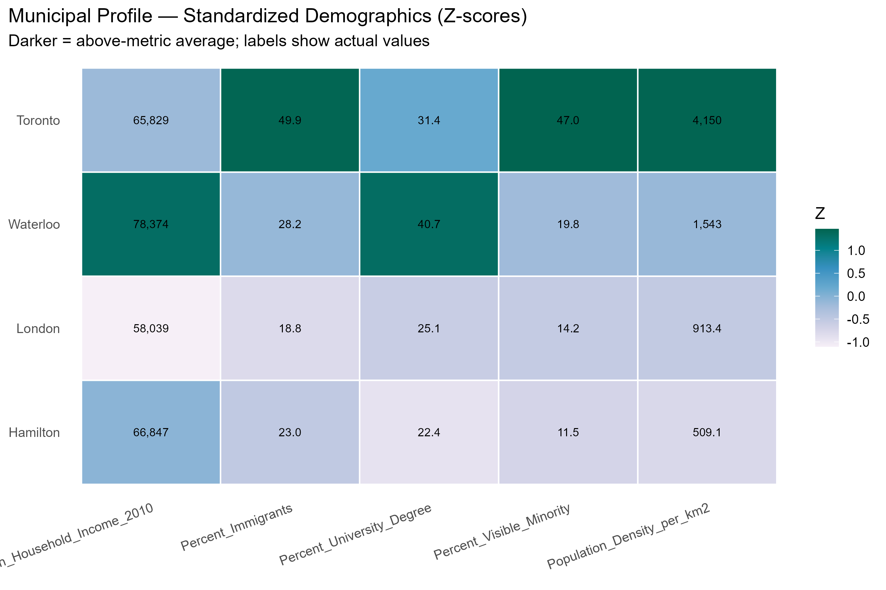
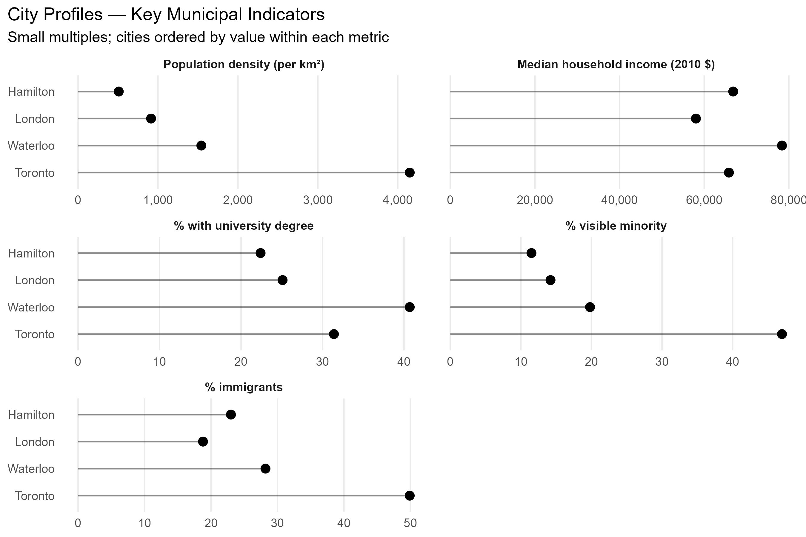
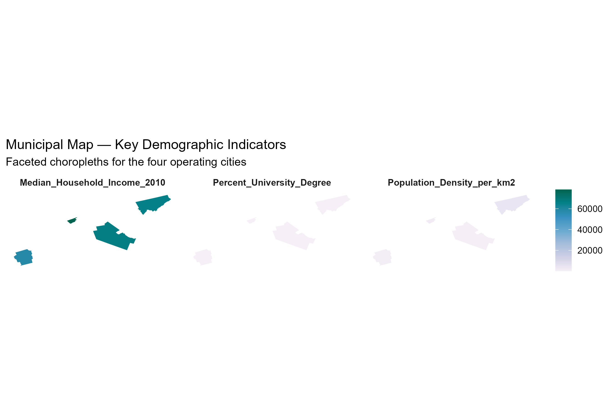

---

## 2. Consumer Spending Analysis (R/ggplot2)

Exploratory analysis of income vs. spending patterns segmented by education level and household type, plus wine vs. meat spending relationships with LOESS smoothing.

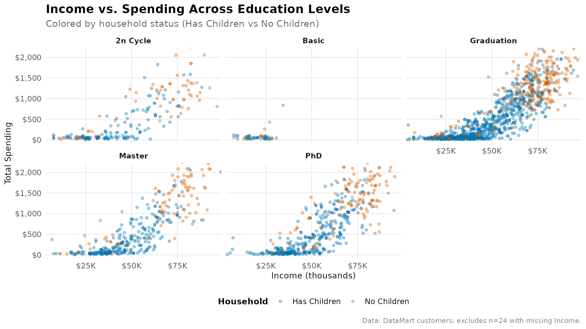
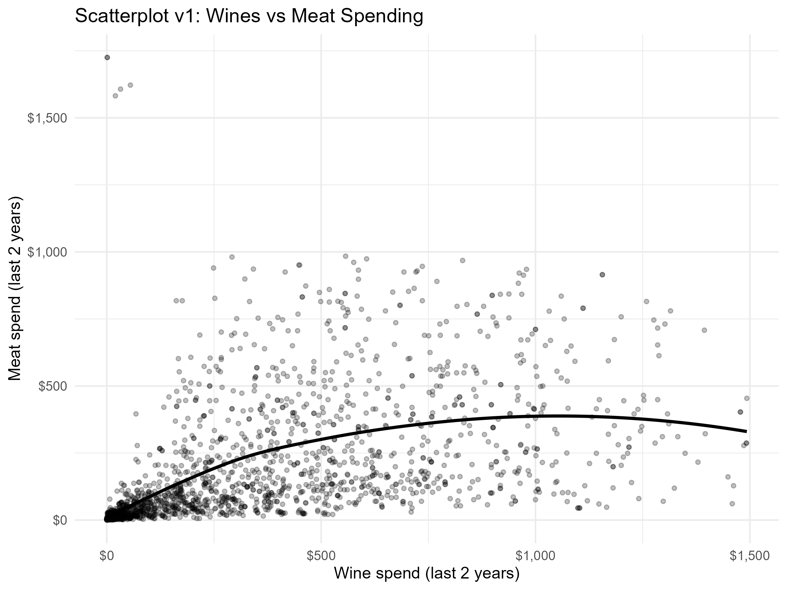

---

## 3. Education Program Participation and Retention (R/ggplot2)

Analysis of school program participation rates by region and school type, and retention rates by poverty level. Includes heatmaps, scatter plots, box plots, and stacked bar charts examining operational efficiency metrics.

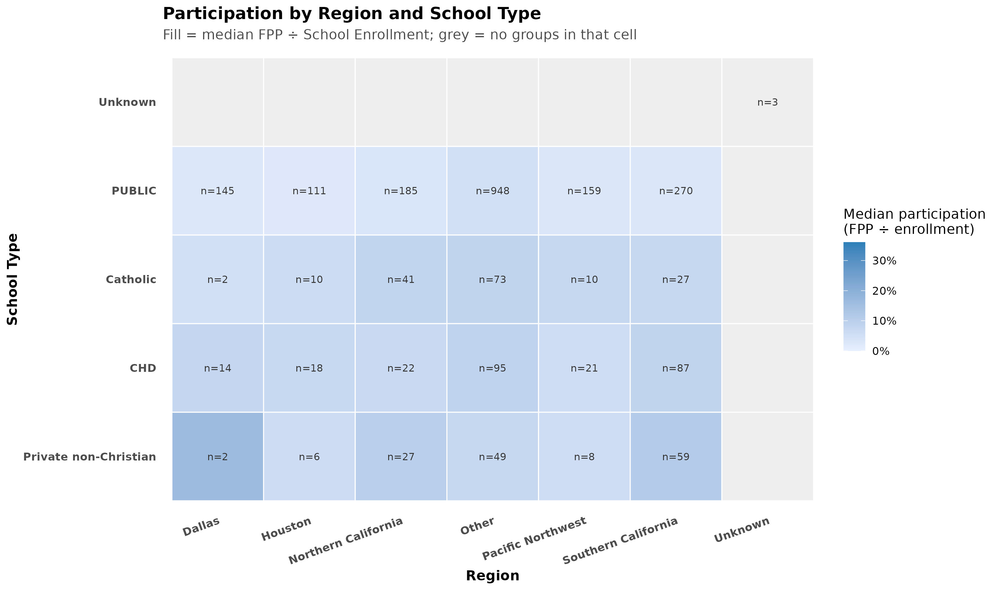
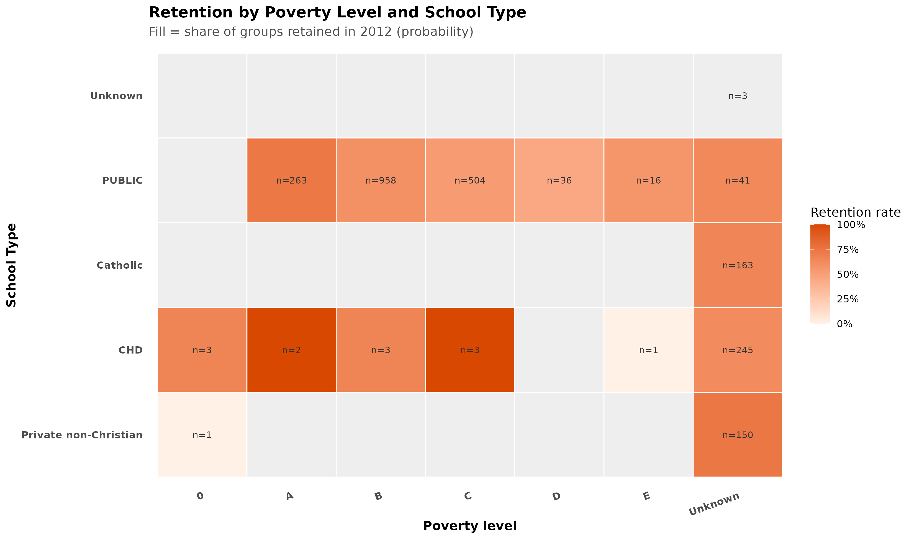
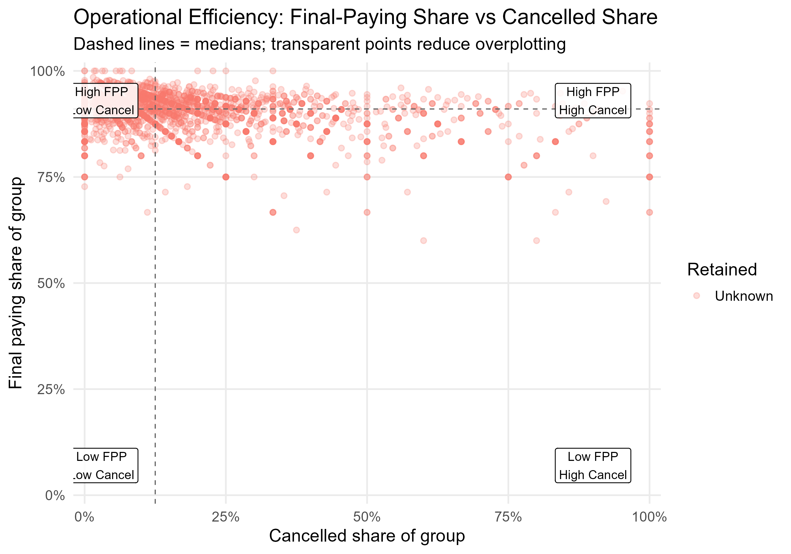
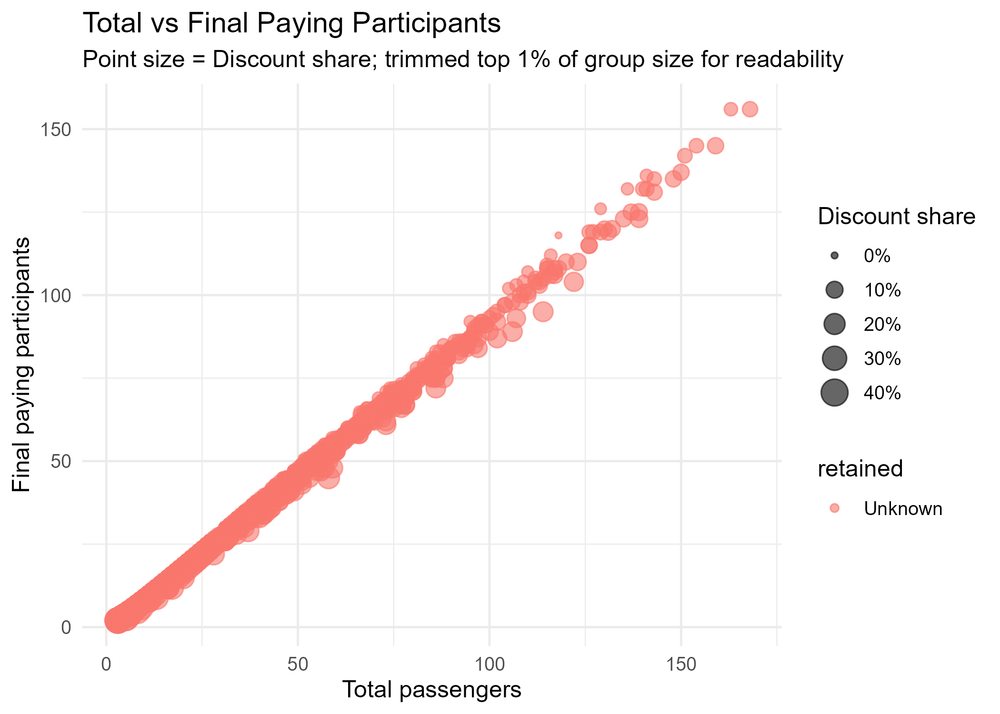
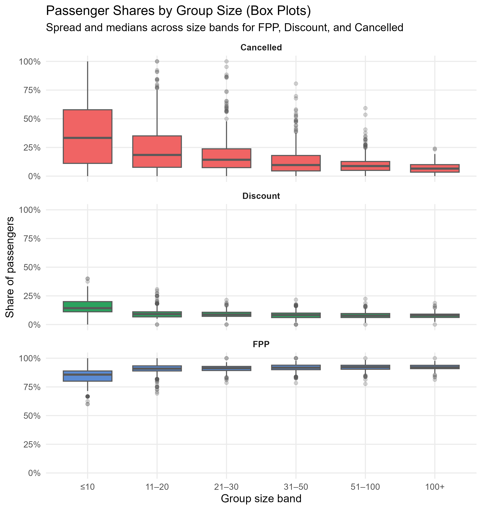
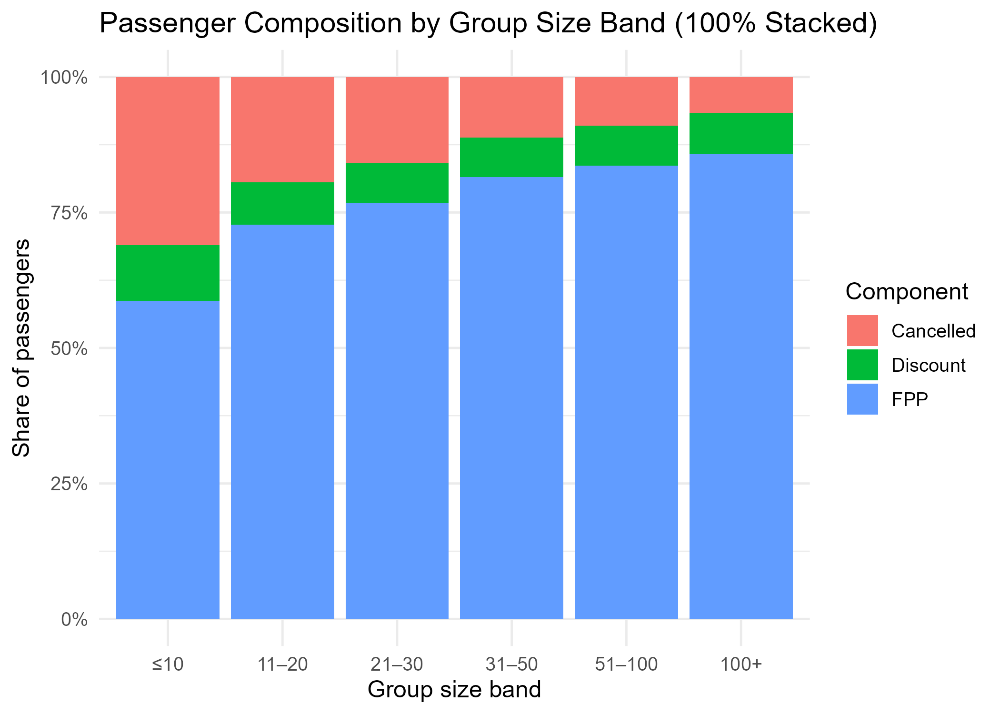
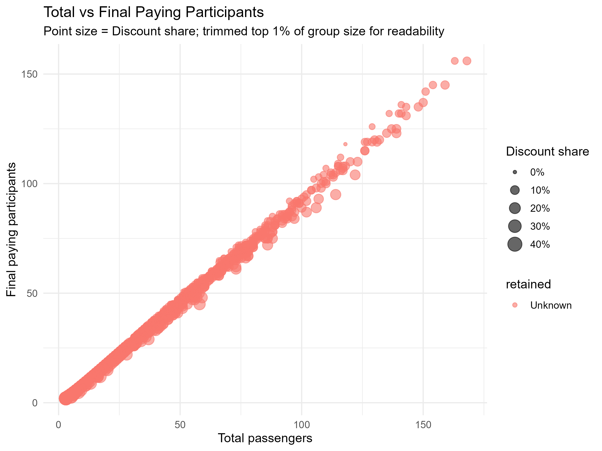

---

## 4. COVID-19 Global Dashboard (Tableau)

Interactive dashboard analyzing confirmed COVID-19 cases, geographic spread, and mortality rates across countries. Built with Johns Hopkins CSSE data.

[View PDF](COVID19-Visualization_Bek.pdf)
